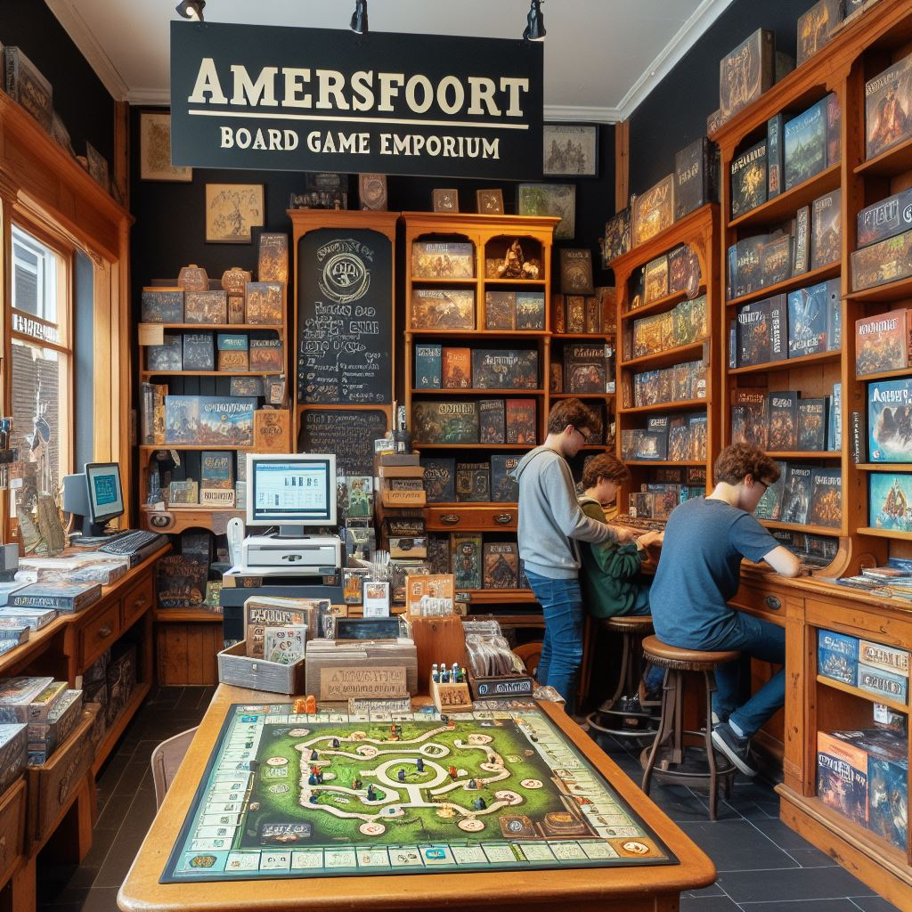

# Amersfoort Boardgame Emporium

This is my first project, working in a team format.
Focus points:
* Pull requests
* GitHub projects
* Ticketing process - to do, in progress & done

### What I am busy learning and upskilling in:

### Where I do it

### Language

